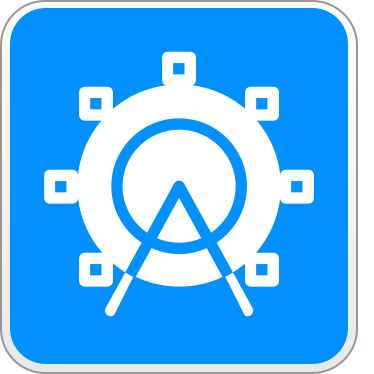

<!--  -->
<h1 style="text-align: center;">
The App Fair Project
Le Projet App Fair
El Proyecto App Fair
O Projeto App Fair
Il Progetto App Fair
Das App Fair Projekt
Проект App Fair
App Fairプロジェクト
앱 페어 프로젝트
App Fair项目
App Fair項目
مشروع App Fair
</h1>

The App Fair Project is a non-profit charitable organization dedicated to creation of mobile software applications for the public good. The project was founded in 2022 as a worldwide nexus for free apps to be built, distributed, and maintained.
Le projet App Fair est une organisation caritative à but non lucratif dédiée à la création d'applications logicielles mobiles pour le bien public. Le projet a été fondé en 2022 en tant que nœud central mondial pour la construction, la distribution et la maintenance d'applications gratuites.
El Proyecto App Fair es una organización benéfica sin fines de lucro dedicada a la creación de aplicaciones de software móvil para el bien público. El proyecto fue fundado en 2022 como un nexo mundial para que las aplicaciones gratuitas sean construidas, distribuidas y mantenidas.
O Projeto App Fair é uma organização de caridade sem fins lucrativos dedicada à criação de aplicativos de software móvel para o bem público. O projeto foi fundado em 2022 como um nexo mundial para que aplicativos gratuitos sejam construídos, distribuídos e mantidos.
Il Progetto App Fair è un'organizzazione benefica no-profit dedicata alla creazione di applicazioni software mobili per il bene pubblico. Il progetto è stato fondato nel 2022 come un nexus mondiale per la costruzione, distribuzione e manutenzione di app gratuite.
Das App Fair Projekt ist eine gemeinnützige wohltätige Organisation, die der Erstellung von mobilen Softwareanwendungen für das öffentliche Wohl gewidmet ist. Das Projekt wurde 2022 als weltweiter Knotenpunkt für den Aufbau, die Verteilung und Wartung kostenloser Apps gegründet.
Проект App Fair - это некоммерческая благотворительная организация, посвященная созданию мобильных приложений для общественного блага. Проект был основан в 2022 году в качестве глобального узла для создания, распространения и обслуживания бесплатных приложений.
App Fair プロジェクトは、公共のためのモバイルソフトウェアアプリケーションの開発に奔走する非営利的な慈善団体です。このプロジェクトは、2022年に、無料アプリが構築、配布、保守される世界的なネクサスとして設立されました。
앱 페어 프로젝트는 공공의 이익을 위한 모바일 소프트웨어 응용 프로그램 개발을 목적으로 한 비영리 공익 단체입니다. 이 프로젝트는 2022년에 무료 앱을 구축, 배포 및 유지 보수하는 세계적인 허브로 설립되었습니다.
App Fair 计划是一家致力于为公共利益开发移动软件应用程序的非营利性慈善机构。该计划于 2022 年成立，旨在成为全球免费应用程序的建设、分发和维护中心。
App Fair項目是一個致力於為公共利益創建移動軟體應用程序的非營利慈善機構。該項目於2022年成立，旨在成為免費應用程序的全球中心，用於建立、分發和維護。
مشروع برنامج التطبيقات النموذجية هو مؤسسة خيرية غير ربحية مخصصة لإنشاء تطبيقات البرمجيات اللاسلكية للمصلحة العامة. تم تأسيس المشروع في عام 2022 بهدف توفير مركز عالمي لبناء وتوزيع وصيانة التطبيقات المجانية.

App Fair apps contain no built-in ad-tech or non-consensual tracking technologies. They are created from free and open-source software and are funded solely by donations and grants.
Les applications App Fair ne contiennent aucune technologie publicitaire intégrée ou de suivi non consensuel. Elles sont créées à partir de logiciels libres et open source et sont financées uniquement par des dons et des subventions.
Las aplicaciones de App Fair no contienen tecnología publicitaria integrada ni tecnologías de seguimiento no consensuadas. Se crean a partir de software libre y de código abierto y están financiadas únicamente por donaciones y subvenciones.
Os aplicativos do App Fair não contêm tecnologia publicitária integrada ou tecnologias de rastreamento não consensuais. Eles são criados a partir de software livre e de código aberto e são financiados exclusivamente por doações e subsídios.
Le app di App Fair non contengono tecnologie pubblicitarie o di tracciamento non consensuali integrate. Sono create da software libero e open source e sono finanziate esclusivamente da donazioni e sovvenzioni.
App Fair Apps enthalten keine eingebettete Werbetechnologie oder nicht einvernehmliche Tracking-Technologien. Sie werden aus freier und Open-Source-Software erstellt und ausschließlich durch Spenden und Zuschüsse finanziert.
Приложения App Fair не содержат встроенных рекламных или несогласованных технологий отслеживания. Они созданы на основе бесплатного и открытого программного обеспечения и финансируются исключительно за счет пожертвований и грантов.
App Fairのアプリには、埋め込み広告テクノロジーや同意のないトラッキングテクノロジーは含まれていません。それらは、無料およびオープンソースソフトウェアから作成され、費用は供稿や授業金のみで賄います。
앱 페어 앱에는 내장된 광고 기술이나 비동의 추적 기술이 없습니다. 그것들은 무료 및 오픈 소스 소프트웨어에서 만들어지며 기부금 및 지원금으로만 지원됩니다.
App Fair应用程序不包含任何内置的广告技术或非同意跟踪技术。它们是从免费和开源软件创建出来的，并且仅由捐赠和资助支持。
App Fair應用程序不包含任何內置的廣告技術或非同意追踪技術。它們是從免費和開源軟件創建出來的，並且僅由捐贈和資助支持。
لا تحتوي تطبيقات App Fair على أي تكنولوجيات إعلانية مضمنة أو تكنولوجيات تتبع غير موافق عليها. إنها تُنشأ من برمجيات حرة ومفتوحة المصدر وتُمول بشكل وحيد عن طريق التبرعات والعطاءات.

Our first project is launching an iPhone app store in the European Union in 2024 to distribute these community-led applications, starting with our "Net Skip" web browser. The "App Fair" marketplace app will be used to discover, review, install, and update the apps in our catalog.
Notre premier projet consiste à lancer un magasin d'applications iPhone dans l'Union européenne en 2024 pour distribuer ces applications dirigées par la communauté, à commencer par notre navigateur web "Net Skip". L'application de marché "App Fair" sera utilisée pour découvrir, examiner, installer et mettre à jour les applications de notre catalogue.
Nuestro primer proyecto es lanzar una tienda de aplicaciones para iPhone en la Unión Europea en 2024 para distribuir estas aplicaciones lideradas por la comunidad, comenzando con nuestro navegador web "Net Skip". La aplicación de mercado "App Fair" se utilizará para descubrir, revisar, instalar y actualizar las aplicaciones de nuestro catálogo.
Nosso primeiro projeto é lançar uma loja de aplicativos para iPhone na União Europeia em 2024 para distribuir esses aplicativos liderados pela comunidade, começando com nosso navegador da web "Net Skip". O aplicativo de mercado "App Fair" será usado para descobrir, revisar, instalar e atualizar os aplicativos em nosso catálogo.
Il nostro primo progetto è lanciare un negozio di app iPhone nell'Unione Europea nel 2024 per distribuire queste applicazioni guidate dalla community, a partire dal nostro browser web "Net Skip". L'app di mercato "App Fair" verrà utilizzata per scoprire, esaminare, installare e aggiornare le app del nostro catalogo.
Unser erstes Projekt ist der Start eines iPhone-App-Stores in der Europäischen Union im Jahr 2024, um diese von der Gemeinschaft geleiteten Anwendungen zu vertreiben, beginnend mit unserem "Net Skip"-Webbrowser. Die "App Fair"-Marktplatz-App wird verwendet, um die Apps in unserem Katalog zu entdecken, zu überprüfen, zu installieren und zu aktualisieren.
Наш первый проект запускает магазин приложений iPhone в Европейском союзе в 2024 году для распространения этих приложений, руководимых сообществом, начиная с нашего веб-браузера "Net Skip". Приложение "App Fair" на рынке будет использоваться для обнаружения, просмотра, установки и обновления приложений в нашем каталоге.
私たちの初めてのプロジェクトは、2024年に欧州連合でこれらのコミュニティーリードアプリケーションを配布するために、アイフォーン用のアプリストアを開設することです。まず私たちの「Net Skip」ウェブブラウザーから始めます。「App Fair」のマーケットプレイスアプリは、カタログ内のアプリを探し、レビューし、インストールし、更新するために使用されます。
우리의 첫 번째 프로젝트는 이러한 커뮤니티 주도 애플리케이션을 유럽 연합에서 배포하기 위해 2024년에 iPhone 앱 스토어를 출시하는 것입니다. 우리의 "넷 스킵" 웹 브라우저부터 시작합니다. "앱 페어" 마켓플레이스 앱은 카탈로그의 앱을 발견, 검토, 설치 및 업데이트하는 데 사용됩니다.
我们的首个项目是在2024年在欧盟推出一个iPhone应用商店，以分发这些社区领导的应用程序，从我们的“Net Skip”网络浏览器开始。“App Fair”市场应用程序将用于发现、审阅、安装和更新我们目录中的应用程序。
我們的首個項目是在2024年在歐盟推出一個iPhone應用商店，以分發這些社區領導的應用程序，從我們的“Net Skip”網路瀏覽器開始。“App Fair”市場應用程序將用於發現、審閱、安裝和更新我們目錄中的應用程序。
مشروعنا الأول هو إطلاق متجر تطبيقات iPhone في الاتحاد الأوروبي في عام 2024 لتوزيع هذه التطبيقات المقيدة من قبل المجتمع، بدءًا بمتصفح الويب "Net Skip" الخاص بنا. سيتم استخدام تطبيق "App Fair" للسوق لإكتشاف ومراجعة وتثبيت وتحديث التطبيقات في دليلنا.

Contact us at <a href="mailto:info@appfair.org">info@appfair.org</a> for information on programs, volunteer opportunities, and upcoming events.
Contactez-nous à <a href="mailto:info@appfair.org">info@appfair.org</a> pour obtenir des informations sur les programmes, les opportunités de bénévolat et les événements à venir.
Contáctenos a <a href="mailto:info@appfair.org">info@appfair.org</a> para obtener información sobre programas, oportunidades de voluntariado y eventos próximos.
Entre em contato conosco em <a href="mailto:info@appfair.org">info@appfair.org</a> para obter informações sobre programas, oportunidades de voluntariado e eventos futuros.
Contattaci a <a href="mailto:info@appfair.org">info@appfair.org</a> per informazioni su programmi, opportunità di volontariato e eventi futuri.
Kontaktieren Sie uns unter <a href="mailto:info@appfair.org">info@appfair.org</a> für Informationen zu Programmen, freiwilligen Möglichkeiten und bevorstehenden Veranstaltungen.
Свяжитесь с нами по адресу <a href="mailto:info@appfair.org">info@appfair.org</a> для получения информации о программах, возможностях волонтерства и предстоящих мероприятиях.
プログラム、ボランティア活動、そして今後のイベントに関する情報については、<a href="mailto:info@appfair.org">info@appfair.org</a> までご連絡ください。
프로그램, 봉사 기회 및 다가오는 이벤트에 대한 정보를 얻으려면 <a href="mailto:info@appfair.org">info@appfair.org</a>로 문의하십시오.
有关项目、志愿者机会和即将到来的活动的信息，请通过<a href="mailto:info@appfair.org">info@appfair.org</a>联系我们。
有關項目、志願者機會和即將到來的活動的資訊，請通過<a href="mailto:info@appfair.org">info@appfair.org</a>聯繫我們。
للحصول على معلومات حول البرامج وفرص التطوع والأحداث القادمة، يرجى الاتصال بنا على <a href="mailto:info@appfair.org">info@appfair.org</a>.
